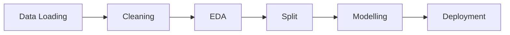

# ml-playground 🧪

Perjalanan pribadi belajar **Machine Learning dari nol**. Setiap proyek dikerjakan langkah demi langkah — dari data mentah sampai deployment, supaya alurnya paham bukan cuma menyalin kode. Semua proyek dikumpulkan di satu tempat.

> **Prinsip:** konsep dasar yang dipelajari tidak lekang waktu. Tool boleh berganti, fondasinya tidak.

## Proyek

| Proyek | Apa yang dipelajari | Hasil | Status |
|--------|-------------------|-------|--------|
| [house-price](./house-price/) | Alur ML lengkap: cleaning → EDA → modelling → **API Flask** | Prediksi harga rumah, **R² 0.90** | ✅ Selesai |

_Proyek lain akan ditambahkan di sini seiring perjalanan belajar._

## Gaya belajar

Setiap proyek dipecah jadi langkah bernomor (`01_`, `02_`, ...) supaya tiap tahap bisa dipelajari dan diuji sendiri:



## Cara menjalankan

```bash
# Buat env sekali di root (dipakai semua proyek)
python -m venv venv
source venv/bin/activate

# Jalankan proyek
cd house-price
pip install -r requirements.txt
python 11_modelling.py
```

## Roadmap

- [x] Modul 3 — ML Workflow (house-price)
- [ ] Modul 4 — Klasifikasi
- [ ] Modul 5 — Regresi
- [ ] Modul 6 — Clustering