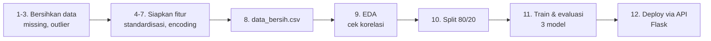

# 🏠 Prediksi Harga Rumah

Proyek belajar Machine Learning pertama di `ml-playground`. **Dari dataset mentah → API prediksi harga yang berfungsi**, dipraktikkan langkah demi langkah.

Dataset: [House Prices - Advanced Regression Techniques](https://www.kaggle.com/competitions/house-prices-advanced-regression-techniques) (Kaggle).

**Hasil akhir:** model Gradient Boosting (R² = 0.90) disajikan lewat API Flask → `POST /predict` → prediksi harga rumah.

## Alur belajar



| # | File | Apa yang dipelajari |
|---|------|---------------------|
| 1 | `01_load_data.py` | Membaca CSV, melihat struktur data |
| 2 | `02_check_missing.py` | Mendeteksi nilai kosong (missing) |
| 3 | `03_fill_missing.py` | Mengisi missing → median (numerik), mode (kategorik) |
| 4 | `04_outlier.py` | Mendeteksi & menghapus outlier (IQR) |
| 5 | `05_standardize.py` | Standardisasi (mean=0, std=1) |
| 6 | `06_check_duplicate.py` | Cek baris duplikat |
| 7 | `07_encoding.py` | Encoding: One-Hot vs Label Encoding |
| 8 | `08_build_clean_data.py` | **Konsolidasi**: menghasilkan `data_bersih.csv` bersih |
| 9 | `09_eda.py` | EDA: histogram, distribusi, korelasi dengan harga |
| 10 | `10_split_data.py` | Split data train/test (80/20) |
| 11 | `11_modelling.py` | Latih 3 model, bandingkan, simpan yang terbaik |
| 12 | `12_api.py` | Deployment: API Flask yang bisa dipanggil siapa pun |

`flow.md` berisi rangkuman alur & konsep (cheat-sheet).

## Hasil model

| Model | MAE | R² |
|-------|-----|-----|
| LARS | 41.795 | 0.15 |
| Linear Regression | 13.912 | 0.89 |
| **Gradient Boosting (terpilih)** | **12.910** | **0.90** |

## Cara menjalankan

Venv dipakai bersama di root repo:

```bash
# 1. Dari repo root ml-playground
python -m venv venv
source venv/bin/activate        # Linux/Mac
# venv\Scripts\activate         # Windows

# 2. Instal dependencies proyek ini
cd house-price
pip install -r requirements.txt

# 3. Jalankan pipeline
python 08_build_clean_data.py   # → data_bersih.csv
python 10_split_data.py         # → train/test CSV
python 11_modelling.py          # → gbr_model.joblib

# 4. Nyalakan API
python 12_api.py                # server di 127.0.0.1:5000

# 5. Minta prediksi (di terminal lain)
curl -X POST http://127.0.0.1:5000/predict \
     -H "Content-Type: application/json" \
     -d @data.json
# → {"prediction": [91352.66]}
```

> Jika venv tidak diaktifkan, jalankan langsung: `../venv/bin/python 08_build_clean_data.py`

Contoh respons `12_api.py` dengan data rumah real: `data.json` = 1 rumah dari data uji, harga asli 85.000 → prediksi 91.352 (error ~7%). Terverifikasi jalan end-to-end.

## Struktur repo

```
house-price/
├── 01_load_data.py ... 12_api.py   ← latihan bernomor (alur belajar)
├── dataset/                         ← data Kaggle (tidak di-commit)
├── data.json                        ← contoh input API
├── flow.md                          ← cheat-sheet alur & konsep
└── requirements.txt                 ← dependencies
```

`*.csv`, `*.png`, `*.joblib`, `*.pkl` (hasil pipeline & grafik) tidak di-commit.

## Environment

Python 3.14 (Arch Linux, PEP 668 → wajib venv), pandas 3.0.5, scikit-learn 1.9.1, Flask 3.1.3. Grafik disimpan ke PNG (backend Agg, tanpa display).

## Sumber

- Dataset milik Kaggle; kode latihan bebas dipakai untuk belajar.